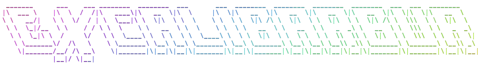

                                                                                                                        
# 👋 About Me

- 👤 **Name:** Bar A.  
- 🧑‍🎓 **Status:** 25 y/o, B.Sc. Computer Science Student  
- 🏫 **College:** Sapir College, Israel – 2nd Year  

## 💻 Dev. Languages & Interests

- ☕ Java • 💾 C/C++ • 🧱 Assembly • 🐍 Python • 🗄️ SQL • 🔌 Verilog
- 🐧 Linux, Raspberry Pi, networking, automation, backend tools  
- 🎛️ Digital systems, operating systems & low-level logic  
- 🧪 Love tinkering with hardware + software integration

## 🚀 Projects & Stuff

- 🤖 Telegram bots & automation tools  
- 🖼️ Image / metadata processing & database-backed tools  
- 🧩 Debugging, reverse engineering, and system optimization  

## 🌐 Languages

- 🇮🇱 Hebrew – Native  
- 🇬🇧 English – Fluent (including technical documentation)  
